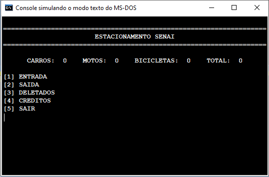
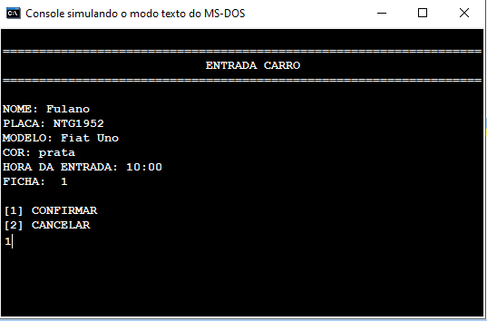

# Parking control
> A pseudocode that manages the entry and exit of vehicles from an establishment.

[![Code Size][code-size]][code-url]
[![License][MIT-license]][MIT-url]
[![Realese][version]][version-url]

Manages the entry and exit of vehicles from an establishment, through a card count, with the registration of vehicle information.

🇧🇷 [Portuguese version](../README.md)

🇺🇸 English version

<p align="center">
    </img>
</p>

## 🎯 Objective

The objective of the project is to manage the entry and exit of vehicles from an establishment. It was developed, thinking about our SENAI unit, as a security measure.

## ✒️ Justification

During the project, the knowledge acquired during the Programming Logic course of the Systems Development technical course - SENAI was put into practice.

## 👷 Installation

Clone repository:

```git
git clone https://github.com/gcairesdev/parking-control
```

Run the _parking-control.ALG_ file:

For that you will need [VisualG](https://visualg3.com.br/)

## 👨‍🏫 Usage example

Some screenshots of the running program:

- Program initial screen

<p align="center">
    </img>
</p>

- Choice of vehicle to be registered

<p align="center">
    </img>
</p>

- Fill in vehicle information

<p align="center">
    </img>
</p>

- List of vehicles in the parking lot

<p align="center">
    </img>
</p>

- Filling out vehicle data

<p align="center">
    </img>
</p>

- List of vehicles that have left ("deleted")

<p align="center">
    </img>
</p>

- Credits

<p align="center">
    </img>
</p>

## 👨🏼‍💻 Author

Photo | Name | GitHub | Likedin | E-mail
---- | ---- | ------ | ------- | ------
 | Guilherme Caires | [gcairesdev](https://github.com/gcairesdev) | [Linkedin](https://linkedin.com/in/guilherme-caires/) | contatogcaires@gmail.com
 | Jefferson Eloy   | [jeffeloy](https://github.com/jeffeloy) | [Linkedin](https://www.linkedin.com/in/jefferson-eloy/) | contatojeloydev@gmail.com
 | Joanderson Santos| [joandersonSJ](https://github.com/joandersonSJ) | [Linkedin](https://www.linkedin.com/in/oanderson-santos-5b63a9196/) | joandersonsantosdev@gmail.com

## 🤝 Contributing

Check out the [CONTRIBUTING](./CONTRIBUTING.md) page to see the best places to file issues, start discussions and begin contributing.

## 📃 License

Released in 2020.
This project is under the [MIT license](../LICENSE.md).

---

<p align="center">
    Made with :heart: by <a href="https://github.com/gcairesdev">Guilherme Caires</a>
</p>

<!-- Markdown link & img dfn's -->
[code-size]: https://img.shields.io/github/languages/code-size/gcairesdev/parking-control
[code-url]: https://github.com/gcairesdev/parking-control

[MIT-license]: https://img.shields.io/github/license/gcairesdev/parking-control
[MIT-url]: https://github.com/gcairesdev/parking-control/blob/master/LICENSE.md

[version]: https://img.shields.io/github/v/release/gcairesdev/parking-control?include_prereleases
[version-url]: https://github.com/gcairesdev/parking-control
